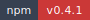

<!-- markdownlint-disable MD013 MD033 -->
<!-- This file is generated by Paradox. Do not edit manually. -->

# INFRA

        

Executable infra provider and standalone CLI for Ankhorage project workflows.

## Usage

### Provider and CLI surface

`@ankhorage/infra` owns infra command behavior.

The same shared command implementation backs both:

- `ankh infra ...`
- `bunx @ankhorage/infra ...`

Current command surface:

- `validate`
- `generate`
- `status`
- `up`
- `down`

`status` runs the generated live runtime status script for a project.

Project resolution is project-aware:

- pass `[project]`, or
- omit it when cwd is already inside `apps/<project>`

Source: `src/readme-usage.ts`

```ts
import { runCli } from './cli.js';

await runCli(['--help']);
```

## Installation

```bash
bunx @ankhorage/infra
```

## Generated documentation

- [Interactive documentation app](././paradox/index.html)
- [Public API reference](././paradox/exports.md)
- [Component registry](././paradox/components.md)
- [Architecture overview](././paradox/diagrams/architecture-overview.mmd)
- [Module relationships](././paradox/diagrams/module-relationships.mmd)
- [Export graph](././paradox/diagrams/export-graph.mmd)
- [ankhorage-infra sequence](././paradox/diagrams/sequences/ankhorage-infra.mmd)
